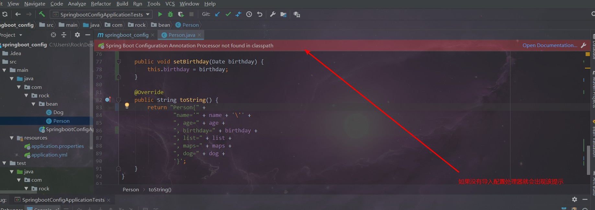

# 一、什么是SprintBoot

> Spring Boot 是 Spring 开源组织下的子项目，是 Spring 组件一站式解决方案，主要是简化了使用 Spring 的难度，简省了繁重的配置，提供了各种启动器，开发者能快速上手。


# 二、SpringBoot的优点与缺点

## 1、优点

1）：快速创建独立运行的Spring项目以及与主流框架集成

2）：使用嵌入式的Servlet容器，应用无需打成war包

3）：starters自动依赖与版本控制

4）：大量的自动配置，简化开发，也可修改默认值

5）：无需配置XML，无代码生成，开箱即用

6）：准生产环境的运行时应用监控

7）：与云计算天然集成

## 2、缺点

1）：入门比较容易，精通难


# 三、微服务简介

## 1、单体应用（ALL IN ONE）

> 所有的页面以及代码都部署在一起


### 1）优点

便于共享：单个归档文件包含所有功能，便于在团队之间以及不同的部署阶段之间共享。
易于测试：单体应用一旦部署，所有的服务或特性就都可以使用了，这简化了测试过程，因为没有额外的依赖，每项测试都可以在部署完成后立刻开始。
易于部署：只需将单个归档文件复制到单个目录下。

### 2）缺点

复杂性高：由于是单个归档文件，所以整个项目文件包含的模块非常多，导致模块的边界模糊、依赖关系不清晰、代码的质量参差不齐，混乱的堆在一起，使得整个项目非常复杂。以致每次修改代码，都非常小心，可能添加一个简单的功能，或者修改一个Bug都会带来隐藏的缺陷。
技术债务：随着时间的推移、需求的变更和技术人员的更替，会逐渐形成应用程序的技术债务，并且越积越多。
扩展能力受限：单体应用只能作为一个整体进行扩展，无法根据业务模块的需要进行伸缩。
阻碍技术创新：对于单体应用来说，技术是在开发之前经过慎重评估后选定的，每个团队成员都必须使用相同的开发语言、持久化存储及消息系统


## 2、微服务

> 微服务，又叫微服务架构，是一种软件架构方式。它将应用构建成一系列按业务领域划分模块的、小的自治服务。每一个功能元素最终都是一个可独立替换和独立升级的软件单元。

​	


### 1）优点

易于开发和维护：一个微服务只会关注一个特定的业务功能，所以业务清晰、代码量较少。开发和维护单个微服务相对简单。
单个微服务启动较快
局部修改容易部署：单体应用只要有修改，就得重新部署整个应用。微服务解决了这样的问题。一般来说，对某个微服务进行修改，只需要重新部署这个服务即可。
技术栈不受限制：在微服务架构中，可以结合项目业务及团队的特点，合理的选择技术栈。
按需伸缩：可根据需求，实现细粒度的扩展。

### 2）缺点

运维要求高：更多的服务意味着要投入更多的运维。
分布式固有的复杂性：使用微服务构建的是分布式系统。对于一个分布式系统，系统容错、网络延迟、分布式事务等都会带来巨大的问题。
接口调整成本高：微服务之间通过接口进行通信。如果修改某一个微服务的API，可能所有用到这个接口的微服务都需要进行调整。

# 四、SpringBoot项目创建流程

第一步：


第二步：


第三步：


第四步：


第七步：删除多余文件


# 五、HelloWorld实例

代码：springboot_example项目

第一步：创建一个Springboot项目

第二步：创建一个HelloWorld的Controller

第三步：编写代码

```java
package com.rock.controller.hello_word;


import org.springframework.web.bind.annotation.RequestMapping;
import org.springframework.web.bind.annotation.RestController;

@RestController
public class HelloWorldController {

    @RequestMapping("/")
    public String helloWorld(){
        return "Hello World";
    }
}

```


第四步：运行main方法，访问路径：http://127.0.0.1:8080/

```java
/**
 *  @SpringBootApplication  用来标注一个主程序类，说明这是一个Springboot应用
 */
@SpringBootApplication
public class SpringbootExampleApplication {

    public static void main(String[] args) {
        //SpringBoot启动
        SpringApplication.run(SpringbootExampleApplication.class, args);
    }

}
```


# 六、HelloWord探究

## 1、POM文件

父项目

```xml
<parent>
    <groupId>org.springframework.boot</groupId>
    <artifactId>spring-boot-starter-parent</artifactId>
    <version>2.1.5.RELEASE</version>
    <relativePath/>
</parent>
以上项目的父项目
<parent>
    <groupId>org.springframework.boot</groupId>
    <artifactId>spring-boot-dependencies</artifactId>
    <version>2.1.5.RELEASE</version>
    <relativePath>../../spring-boot-dependencies</relativePath>
</parent>

该项目定义了SpringBoot使用其他组件的版本号，如果dependencies没有定义的依赖就需要声明版本号

```

## 2、场景启动器

```xml
<dependency>
    <groupId>org.springframework.boot</groupId>
    <artifactId>spring-boot-starter-web</artifactId>
</dependency>
```

spring-boot-starter：SpringBoot场景启动器

spring-boot-starter-web：web场景的启动器，包含web项目所用的基础依赖

## 3、主程序类，主入口类

```java
/**
 *  @SpringBootApplication  用来标注一个主程序类，说明这是一个Springboot应用
 */
@SpringBootApplication
public class SpringbootExampleApplication {

    public static void main(String[] args) {
        //SpringBoot启动
        SpringApplication.run(SpringbootExampleApplication.class, args);
    }

}
```

### **@SpringBootApplication**

> SpringBoot应用标注在某个类上说明这个类是SpringBoot的主配置类，SpringBoot就应该运行这个类的main方法来启动SpringBoot应用

```java
@Target({ElementType.TYPE})
@Retention(RetentionPolicy.RUNTIME)
@Documented
@Inherited
@SpringBootConfiguration
@EnableAutoConfiguration
@ComponentScan(
    excludeFilters = {@Filter(
    type = FilterType.CUSTOM,
    classes = {TypeExcludeFilter.class}
), @Filter(
    type = FilterType.CUSTOM,
    classes = {AutoConfigurationExcludeFilter.class}
)}
)
public @interface SpringBootApplication {
```

#### **@SpringBootConfiguration**

> Spring Boot的配置类，标注在某个类上表示这个类是一个SpringBoot配置类

```java
@Target({ElementType.TYPE})
@Retention(RetentionPolicy.RUNTIME)
@Documented
@Configuration
public @interface SpringBootConfiguration {
}
```

##### **@Configuration**

> 容器中的一个组件，用于定义配置类，可替换xml配置文件，被注解的类内部包含有一个或多个被@Bean注解的方法，这些方法将会被AnnotationConfigApplicationContext或AnnotationConfigWebApplicationContext类进行扫描，，并用于构建bean定义，初始化Spring容器。SpringBootConfiguration注解继承了该注解

### **@EnableAutoConfiguration**

> 开启自动配置功能

```java
@Target({ElementType.TYPE})
@Retention(RetentionPolicy.RUNTIME)
@Documented
@Inherited
@AutoConfigurationPackage
@Import({AutoConfigurationImportSelector.class})
public @interface EnableAutoConfiguration {
```

#### **@AutoConfigurationPackage**

> 自动配置包

```java
@Target({ElementType.TYPE})
@Retention(RetentionPolicy.RUNTIME)
@Documented
@Inherited
@Import({Registrar.class})
public @interface AutoConfigurationPackage {
}
```

##### **@Import({Registrar.class})**

> Spring的底层注解@Import，给容器中导入一个组件，导入的组件由Registrar.class来指定

```java
//metadata：@SpringBootApplication标注类的基本信息
public void registerBeanDefinitions(AnnotationMetadata metadata, BeanDefinitionRegistry registry) {
            AutoConfigurationPackages.register(registry, (new AutoConfigurationPackages.PackageImport(metadata)).getPackageName());
        }
//new AutoConfigurationPackages.PackageImport(metadata)).getPackageName() 会获取到标注了@SpringBootApplication注解的类所在的包以及下面所有子包里面的所有组件扫描到Spring容器
```


#### @Import({AutoConfigurationImportSelector.class})

AutoConfigurationImportSelector类

> 将所有需要导入的组件以全类名的方式返回；这些组件就会被添加到容器中

```java
/**
*	会给容器中导入非常多的自动配置类（xxxAutoConfiguration）；就是给容器中导入这个场景需要的所有组件，*   并配置好这些组件；
*/
protected AutoConfigurationImportSelector.AutoConfigurationEntry getAutoConfigurationEntry(AutoConfigurationMetadata autoConfigurationMetadata, AnnotationMetadata annotationMetadata) {
        if (!this.isEnabled(annotationMetadata)) {
            return EMPTY_ENTRY;
        } else {
            AnnotationAttributes attributes = this.getAttributes(annotationMetadata);
            List<String> configurations = this.getCandidateConfigurations(annotationMetadata, attributes);
            configurations = this.removeDuplicates(configurations);
            Set<String> exclusions = this.getExclusions(annotationMetadata, attributes);
            this.checkExcludedClasses(configurations, exclusions);
            configurations.removeAll(exclusions);
            configurations = this.filter(configurations, autoConfigurationMetadata);
            this.fireAutoConfigurationImportEvents(configurations, exclusions);
            return new AutoConfigurationImportSelector.AutoConfigurationEntry(configurations, exclusions);
        }
    }
```

会给容器中导入非常多的自动配置类（xxxAutoConfiguration）；就是给容器中导入这个场景需要的所有组件，并配置好这些组件；		


# 七、SpringBoot的配置文件

代码：springboot_config 项目中

SpringBoot使用一个全局的配置文件，配置文件名是固定的；

•application.properties

•application.yml

配置文件的作用：修改SpringBoot自动配置的默认值；SpringBoot在底层都给我们自动配置好；

标记语言：

​	以前的配置文件；大多都使用的是  **xxxx.xml**文件；

​	YAML：**以数据为中心**，比json、xml等更适合做配置文件；

​	YAML：配置例子

```yaml
server:
  port: 8081
```

​	XML：

```xml
<server>
	<port>8081</port>
</server>
```

## 1、YAML语法

### 1）基本语法

K:(空格)V：表示一对键值对（空格必须有）

以空格的缩进来控制层级关系，只要左对齐的一列数据，都是同一个层级的

```yaml
server:
	port: 8081
	path: /test
```

属性和值的大小写敏感


## 2、值的写法

### 1）字面量：普通的值（数字、字符串、布尔）

k: v ：字面直接写

​		字符串默认不用加上单引号或者双引号

​		**双引号：**不会转义字符串里面的特殊字符，特殊字符会作为本身想表示的意思

​		例如： “test \n aa”

​		输出：test 换行 aa

​		**单引号：**会转义特殊字符，特殊字符最终只是一个普通的字符串数据

​		例如：‘test \n aa’

​		输出：test \n aa

### 2）对象、Map（属性和值）（键值对）

k: v：在下一行来写对象的属性和值的关系；注意缩进

​		对象还是k: v的方式

```yaml
friends:
		lastName: zhangsan
		age: 20
```

行内写法：

```yaml
friends: {lastName: zhangsan,age: 18}
```


#### 数组（List、Set）：

用- 值表示数组中的一个元素

```yaml
pets:
 - cat
 - dog
 - pig
```

行内写法

```yaml
pets: [cat,dog,pig]
```

### 3）配置文件值的注入

**①：导入配置处理器**

```xml
<dependency>
    <groupId>org.springframework.boot</groupId>
    <artifactId>spring-boot-configuration-processor</artifactId>
    <optional>true</optional>
</dependency>
```

如果不导入文件处理器，编写YMAL的时候没有提示，并且会提示你添加



**②：Bean对象**

```java
/**
 * @ConfigurationProperties：告诉SpringBoot将本类中的所有属性和配置文件中相关的配置进行绑定
 * prefix = "friend" ：配置文件中哪个属性下面的属性进行一一映射
 *
 * 这个组件必须是容器中的组件，才能使用容器提供的@ConfigurationProperties 功能
 */
@Component
@ConfigurationProperties(prefix = "friend")
public class Friend {

    private String name;

    private int age;

    private List<String> list;

    private Map<String, String> maps;

    private Dog dog;

    public String getName() {
        return name;
    }

    public void setName(String name) {
        this.name = name;
    }

    public int getAge() {
        return age;
    }

    public void setAge(int age) {
        this.age = age;
    }

    public List<String> getList() {
        return list;
    }

    public void setList(List<String> list) {
        this.list = list;
    }

    public Map<String, String> getMaps() {
        return maps;
    }

    public void setMaps(Map<String, String> maps) {
        this.maps = maps;
    }

    public Dog getDog() {
        return dog;
    }

    public void setDog(Dog dog) {
        this.dog = dog;
    }


    @Override
    public String toString() {
        return "Friend{" +
                "name='" + name + '\'' +
                ", age=" + age +
                ", list=" + list +
                ", maps=" + maps +
                ", dog=" + dog +
                '}';
    }
}
```

```java
public class Dog {

    private String name;

    private int age;

    public String getName() {
        return name;
    }

    public void setName(String name) {
        this.name = name;
    }

    public int getAge() {
        return age;
    }

    public void setAge(int age) {
        this.age = age;
    }

    @Override
    public String toString() {
        return "Dog{" +
                "name='" + name + '\'' +
                ", age=" + age +
                '}';
    }
}
```

**③：YMAL编写**

```yam
friend:
  name: 张三
  age: 18
  list:
    - list1
    - list2
    - list3
  maps:
    key1: value1
    key2:  value2
  dog:
    name: 旺财
    age: 2

```

④：使用SpringBoot提供的测试类测试


